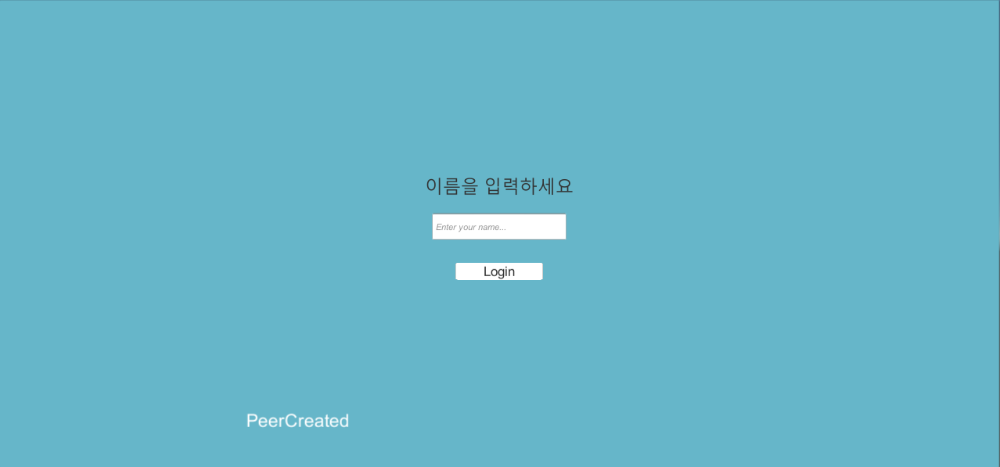
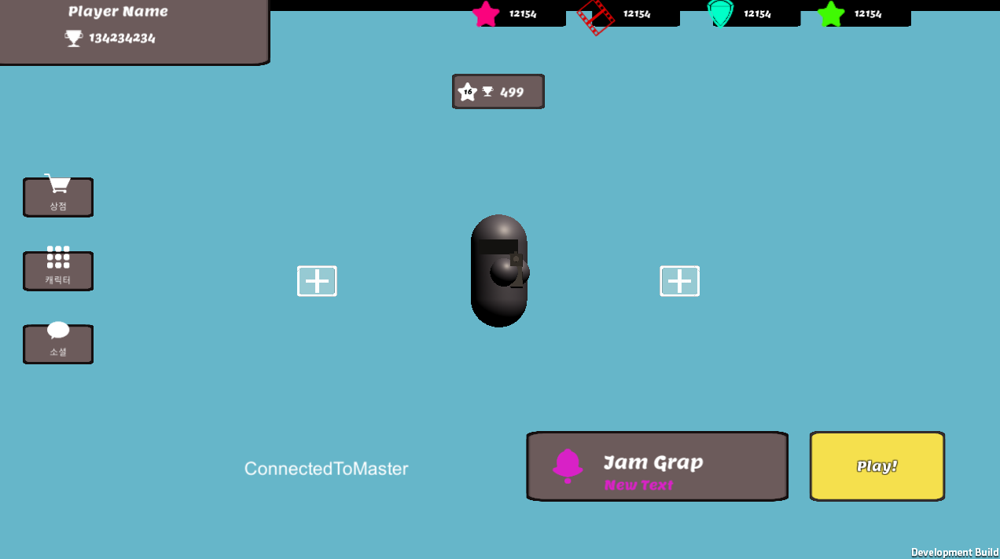
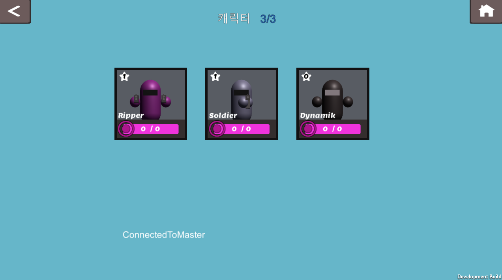
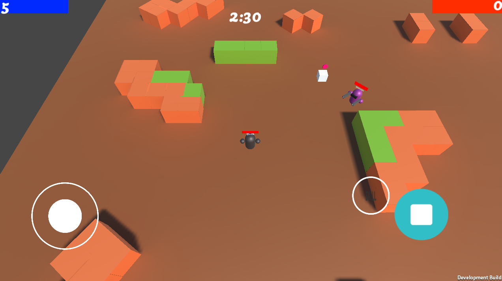
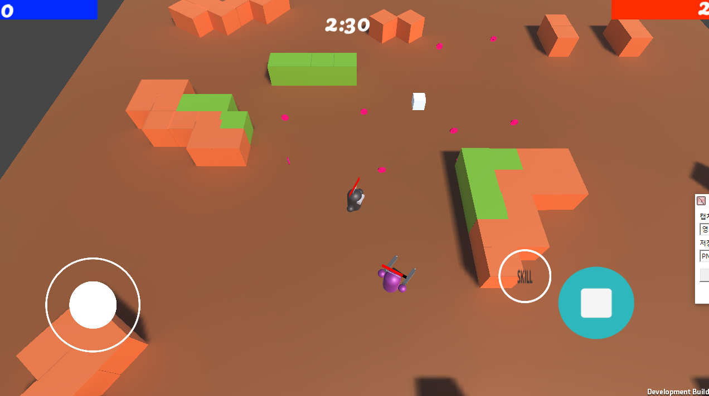
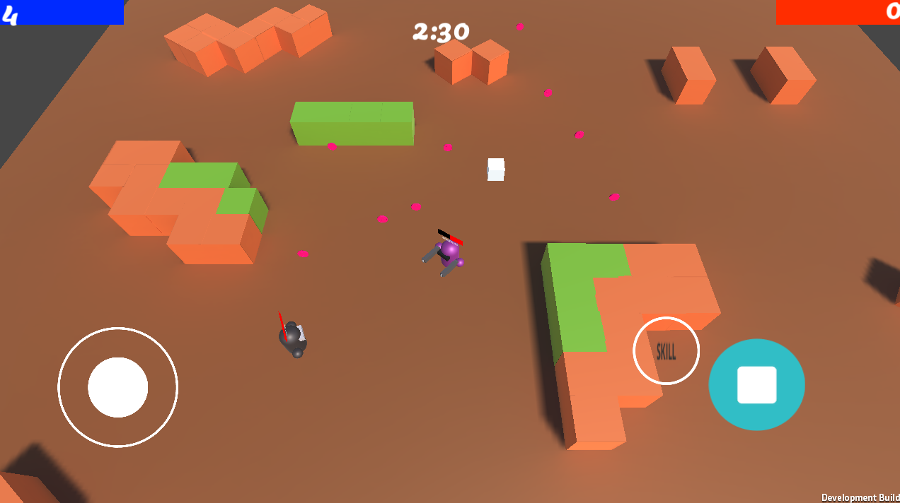
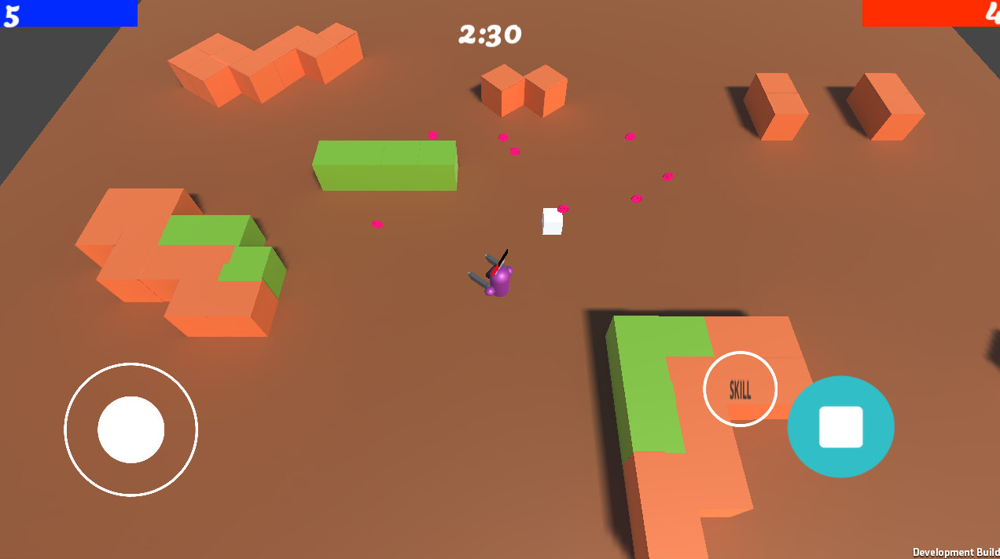
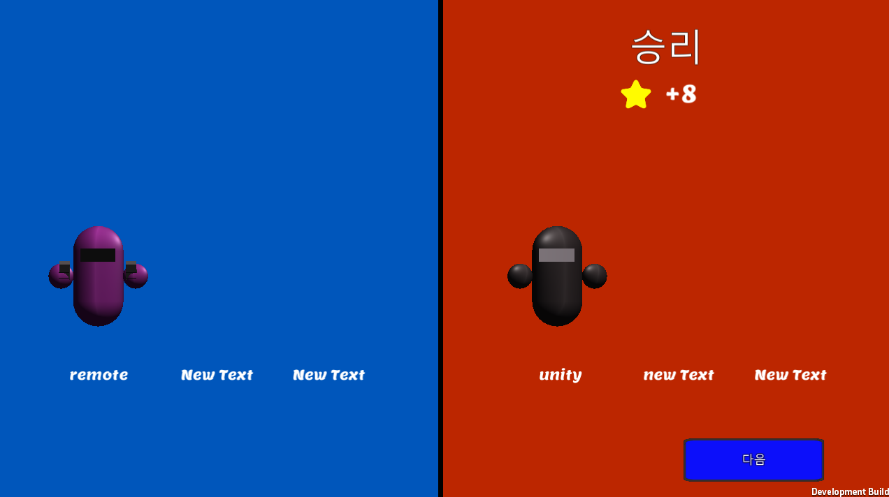

# Mobile-Multiplay-Shooting-Game-
Hommage to Brawl Stars

이 프로젝트는 습작입니다.
포톤을 이용한 멀티플레이 슈팅게임으로, 브롤스타즈를 오마주했습니다.

## 주요기능
- **로그인**

아이디를 입력하여 로그인. 포톤 서버와 연결합니다.

- **캐릭터선택**

원하는 캐릭터를 선택하면 그 캐릭터로 플레이할 수 있습니다

- **랜덤한 방에 조인**

현재 생성된 방 중에서 랜덤하게 조인합니다. 팀은 선착순으로 나뉘어집니다.

- **게임신**

플레이어 각각이 선택한 캐릭터를 생성합니다. 캐릭터 생성 위치는 팀에 따라 달라집니다.
중앙의 상자에서 일정간격으로 코인이 쏘아집니다. 코인을 먹으면 점수가 올라갑니다.

- **체력, 점수 동기화**

##### <플레이어1의 화면>

##### <플레이어2의 화면> 
RPC를 사용해 체력과 점수를 동기화합니다. 

- **캐릭터 숨기기**

##### <플레이어1의 화면> 

##### <플레이어2의 화면> 
풀숲에 숨으면 아군은 보이고, 적군은 보이지 않습니다.

- **결과화면**

승자와 패자를 가시적으로 보여줍니다. 

